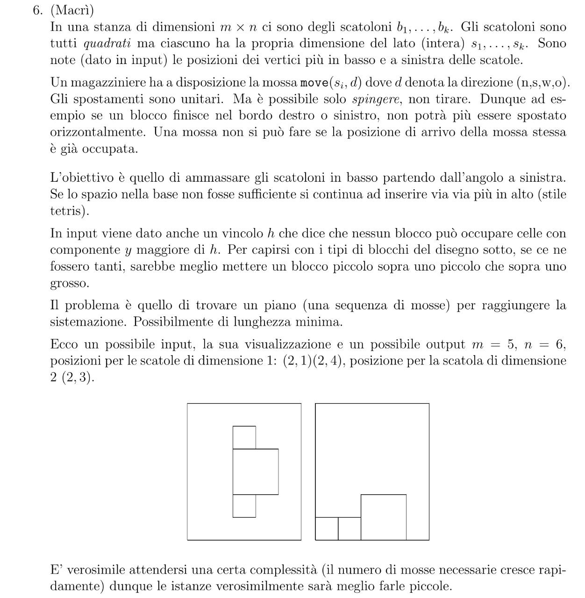

# simpleSokoban

University project for the course of Automated Reasoning. 

## Task

The task, which is a sort of simplified version of the Sokoban is as follows:

In a room of dimensions n × m, there are boxes b1, . . . , bk. The boxes are all squares, but each has its own side length (integer) s1, . . . , sk. The positions of the bottom-left vertices of the boxes are known (given as input).

A warehouse worker has the move(bi, d) move available, where d denotes the direction (n,s,w,e). Movements are unitary. However, it's only possible to push, not pull. Therefore, for example, if a block ends up on the right or left edge, it cannot be moved horizontally anymore. A move cannot be made if the destination position of the move is already occupied.

The objective is to stack the boxes at the bottom starting from the left corner. If the space at the base is not sufficient, more boxes are inserted higher up (Tetris style).

An additional constraint h is given in the input, stating that no block can occupy cells with a y component greater than h. To illustrate with the types of blocks in the diagram below (image 1), if there were many, it would be better to place a small block on top of another small one, and then on top of a large one.

The problem is to find a plan (a sequence of moves) to achieve the arrangement, preferably of minimum length.

Here's a possible input, its visualization, and a possible output. n=5, m=6, positions for boxes of size 1: (2, 1), (2, 4), position for the box of size 2: (2, 3).

## Solutions

To solve the problem, two different programming paradigms were used: Constraint Programming with Minizinc (v2.5.5) and Answer Set Programming with Clingo (v5.5.1). Two different solving techniques were also applied.

In the first approach, the problem was modeled as a decision version, with a fixed number of moves and the search for a solution that used exactly that number of pushes. This method ensures the optimal solution but does not detect inadmissible instances of the problem without further information. Additionally, a significant slowdown was observed as the optimal value increased.

A second approach was adopted to tackle the problem as an optimization, by defining an upper limit on the number of required moves and letting the solver find progressively better solutions. This method allows for checking the inadmissibility of an instance and gradually improving the solution found, but it's not applicable when it's impossible to limit the number of moves.
